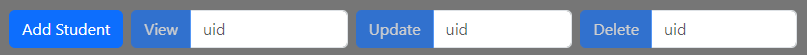
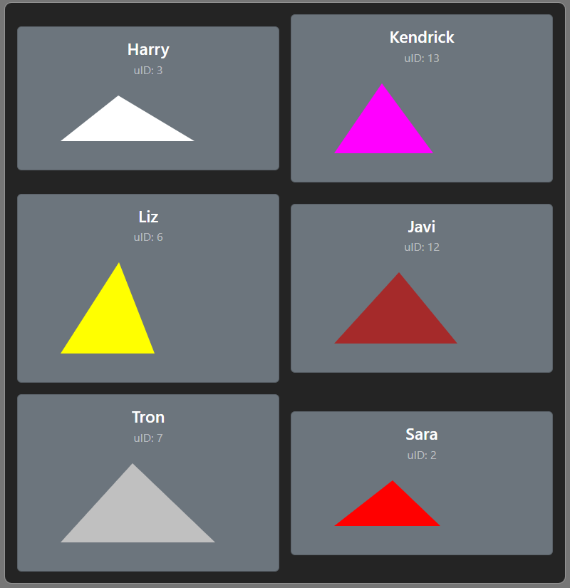
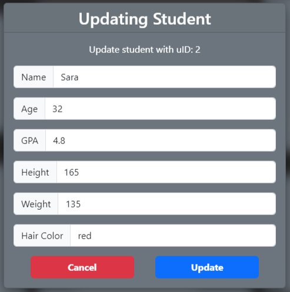
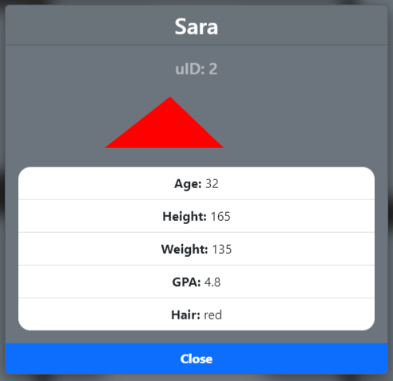
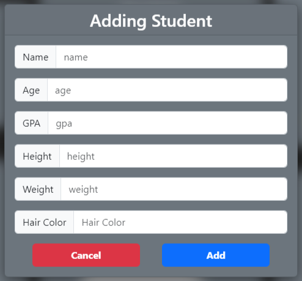
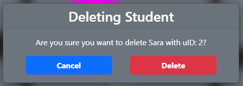
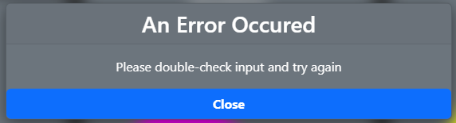

# Student Database - README Copy

Frontend for the Student Database application

## Student Display

---

Each student is displayed on the main screen within their own respective _cards_
and are displayed through triangles that follow the following design principle:

-  Top corner represents student _age_
-  Left corner represents student _height_
-  Right corner represents student _weight_

## Site Workflow

---

The site has a main interaction bar at the top with the following options:

The main display area directly below:

To update, view, and add a student the user gets shown one of these:

To delete a student the user gets shown this on click:

In the case of an input error, the user gets shows this:

## 

## Info

---

-  When running localhost, utilize http://localhost:8080/

## Tools Utilized

---

-  Used [svelte](https://svelte.dev/) to create a reactive webpage
-  Utilized Java Spring in the backend to create endpoints and interact with database
-  Used a PostgreSQL database to store all student data
